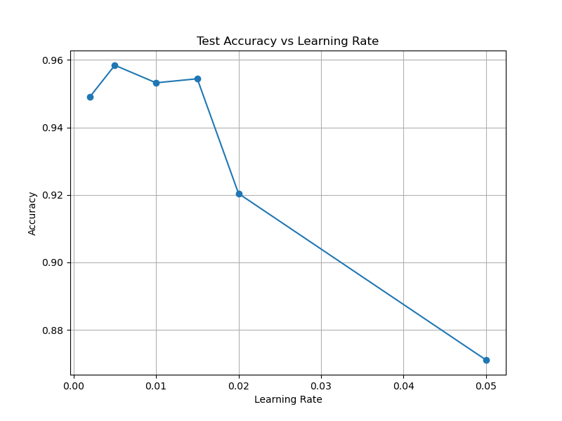
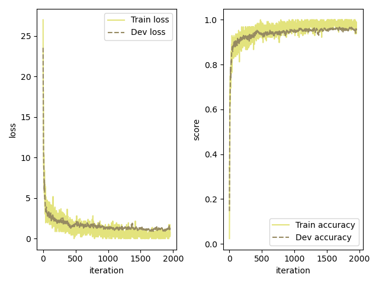

<font color=gray>

### Start Up

First look into the `dataset_explore.ipynb` and get familiar with the data.

### Codes need your implementation

1. `op.py` 
   Implement the forward and backward function of `class Linear`
   Implement the `MultiCrossEntropyLoss`. Note that the `Softmax` layer could be included in the `MultiCrossEntropyLoss`.
   Try to implement `conv2D`, do not worry about the efficiency.
   You're welcome to implement other complicated layer (e.g.  ResNet Block or Bottleneck)
2. `models.py` You may freely edit or write your own model structure.
3. `mynn/lr_scheduler.py` You may implement different learning rate scheduler in it.
4. `MomentGD` in `optimizer.py`
5. Modifications in `runner.py` if needed when your model structure is slightly different from the given example.


### Train the model.

Open test_train.py, modify parameters and run it.

If you want to train the model on your own dataset, just change the values of variable *train_images_path* and *train_labels_path*

### Test the model.

Open test_model.py, specify the saved model's path and the test dataset's path, then run the script, the script will output the accuracy on the test dataset.

<font color=lightgray>

# My Submit

### Model Settings

1. I wrote a new model class named ```Model_CNN```, which utilizes ```conv2D```. However, this realization of convolution layer is so slow. I may try to apply accelerate methods such as using matrix formulation of convolution in future experiments.

2. My best model is a ```Model_MLP``` which size is $784\rightarrow 1024\rightarrow 512\rightarrow 10$ which only uses linear layers. And the evaluation results show that this model reaches the $\mathbf{accuracy} \geq 95\%$.

3. The best model is saved as ```./best_models/best_model.pickle```. 

### Hyperparameter Searching

1. I experimented several hyperparameters. Concretely, I tried $$\text{learning rate} = [0.002, 0.005, 0.01, 0.015, 0.02, 0.05]$$, where 

$$
\begin{cases}
   \text{max epoch} = 5\\
   \text{optimizer} = \text{Adam}\\
   \beta_1=0.9\\
   \beta_2=0.999
\end{cases}
$$
. The results are visualized as:




2. Considering the experiments above, the best learning rate should be $0.005$, and the training process is 

.

### URLs

* $\textbf{code:}$ <https://github.com/Stevendiffdiff/codes.git>

* $\textbf{models:}$ <>